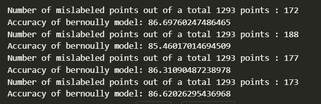
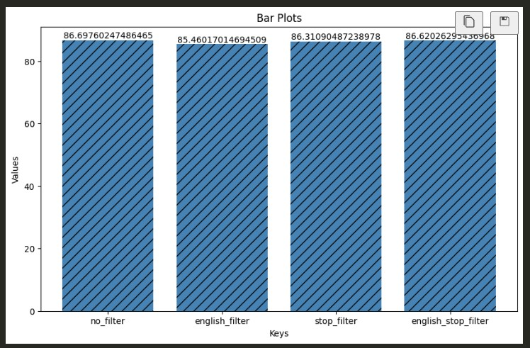
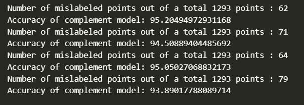
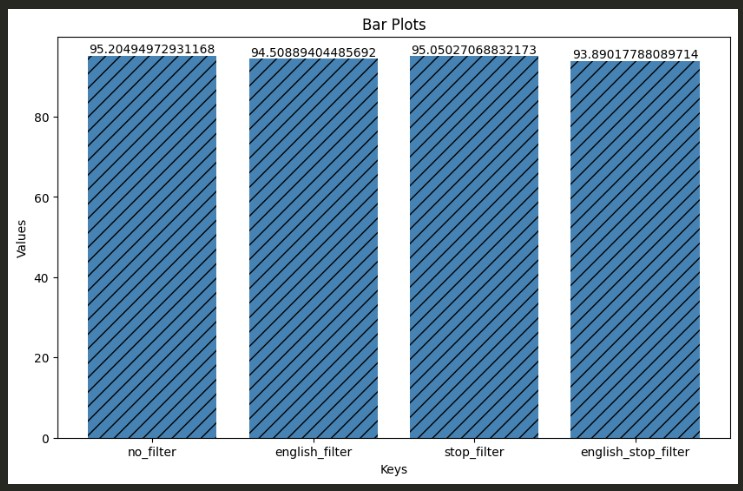
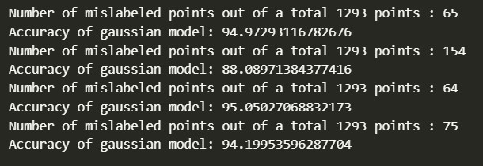
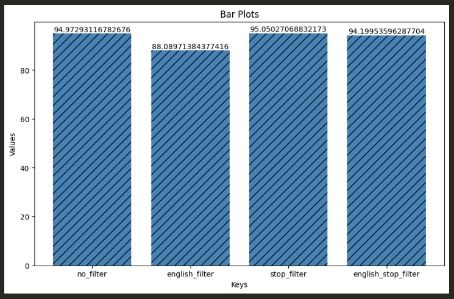
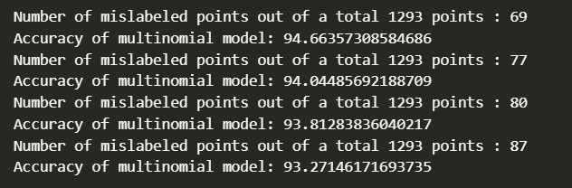
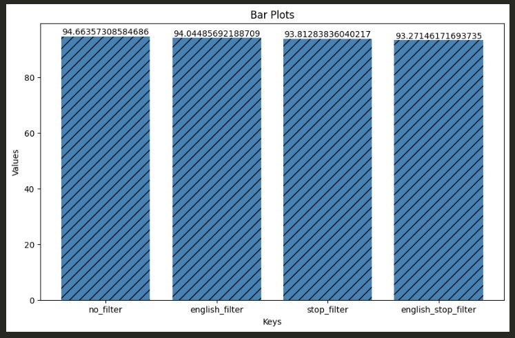

СОФИЙСКИ УНИВЕРСИТЕТ "СВ. КЛИМЕНТ ОХРИДСКИ" 

ФАКУЛТЕТ ПО МАТЕМАТИКА И ИНФОРМАТИКА

 

# **КУРСОВ ПРОЕКТ ПО ИЗКУСТВЕН ИНТЕЛЕКТ**

### тема: 
## _Класификатор на спам електронна поща_

 

### Студенти:
Стефан Бисеров Халваджиев, група 7, 45678

Александра Людмилова Георгиева, група 3, 45531

  

София, юни 2023г.

***

## 1. Формулировка на задачата 

Класификацията на текст е една от най - популярните и приложими задачи, свързани с обработка на естествен език. В разглежданата задача се класифицират текстове - имейли, в две категории - спам и не-спам поща. Целта да се сравнят няколко различни метода за решаване на тази задача. И да се направят изводи на база получените резултати. Използваните методи са описанив т.2.

***

## 2. Използвани алгоритми 

Задачата е да се сравнят няколко алгоритъма, базирани на наивно Бейсово разпределение. Това е вероятностен метод, който за всеки имейл дава класа с най-висока вероятност за принадлежност. Двата класа са спам и не-спам поща. Тези видове класификатори намират приложение в решенията на доста задачи свързани с обработка на естествен език. 

Наивните Бейсови са вероятностни класификатори. Те съпоставят на даден документ класа с най-голяма вероятност този документ да принадлежи на този клас. Вероятността за принадлежност се смята чрез [формулата на Бейс](https://bg.wikipedia.org/wiki/Теорема_на_Бейс) или нейни подобрения, откъдето идва и името на този клас алгоритми. 

Едната вероятност, която е необходима, е тази исканият клас да е клас С, т.е. вероятността текущият документ да принадлежи на клас С. Тя се пресмята като се раздели броят документи, с които се обучава алгоритъма, които са от клас С, на броя на всички документи за обучаване.
Другата вероятност, която се пресмята, е тази текущата дума да се среща в документ от клас С. За целта всички документи от клас С се обединяват в един общ документ. И се пресмята вероятността дадената дума да се среща в този общ текст.

Ако някоя дума се среща в текста на някой тестов документ, но не е част от речника (думите от тренировъчните документи), то тази дума се пренебрегва. 
Други думи, които се пренебрегват са т.нар. стоп думи. В английския език това са често срещани думи като: "a", "the", "of" и други. Един начин да бъдат изчистени тези думи е като се сортира речника и се премахнат първите 10 - 100 срещания. Друг начин, който е и избраният в този проект, е използването на предварително съставен списък от стоп думи. 

Текстовият документ се представя като торба с думи, т.е. не се обръща внимание на позициите на думите, а се разглежда честотата им на срещане.
Друго допускане, което се прави е наивното допускане на Бейс. То гласи, че свойствата на думите, в текущо разглеждания случай това е честотата им на срещане, са независими едно от друго. Така се улесняват иначе тежки изчисления. 

***

## 3. Описание на програмната реализация 

- Предварителна обработка на данните

    - Корпус на данните 

      Работи се със [cvs файл](https://www.kaggle.com/datasets/balaka18/email-spam-classification-dataset-csv?resource=download), който съдържа 5172 реда, всеки от които отговаря за един имейл. Има 3002 колони.Първата колона е за идентификатор на имейла, а последната е за предположение - 0, ако имейлът не е спам, и 1 иначе. Останалите 3000 колони отговарят за най-често срещаните думи от всички имейли. 

    - Премахване на думи, които не са част от английския език
    
      Работи се с речника, получен след сечението на корпуса и речник с думи на английски. Колоните с идентификатор и предположение се добавят обратно.

    - Премахване на стоп думи

      Работи се с речника, получен след разликата на корпуса и готов речник със стоп думи.

- Скриптове 

    - Зареждане на корпуса с данни
      
      По подаден линк функцията `load_dataset` прочита и зарежда cvs файл. 

    - Алгоритми

      Функцията `naive_bayes` приема два аргумента. Първият е стринг, указващ кой вид вероятностно разпределение да се използва. Като втори аргумен се подават данните, с които да се работи. 

      Вариантите за вероятностно разпределение са разпределение на Бернули, съвместно разпределение, мултиномно разпределение и Гаусово разпределение. По няколко думи за всяко от тях са написани в т.2.

      Функцията разделя подадения корпус на данни за обучаване и данни за тестване. В променливите `X_train` и `y_train` се съхраняват данните предназначени за обучаване на мрежата и съответстващите им етикети за "спам" и "не-спам". Аналогично, в `X_test` и `y_test` се съхраняват данните за тестване на мрежата и правилните им етикети. 

      Мрежата, базирана на посоченото разпределение, се обучава върху данните за обучение. След това прави предположения за тестовите данни, които предположения се съхраняват в променливата `y_pred`.

      Сравняват се направените предположения с правилните етикети на тестовите данни. Количествената грешка се натрупва в променливата `misleaded_size`. 

      Функцията връща размерът на тестовите данни `test_size` и броят сгрешени предположения `misleaded_size`.

    - Оценяване 

      Функцията `evaluate` приема три аргумента: броят на всички данни, броят направени грешки от мрежата и използваното разпределение. Тя пресмята и връща процента на успеваемост на мрежата. 

    - Графики

      Функцията `create_barplots` приема данните от работата на мрежата и чертае графика, на която визуално да се покажат разликите в успеваемостта на различните алгоритми.

- Видове класификатори според вероятностното разпределение

    В променливата `calculation_type` се указва желаното разпределение, което да се използва за пресмятанията на вероятностите. 

    След това се зарежда корпуса от имейли в `dataset`. Прилагат се два вида обработка на данните. В `dataset_english_only` се съхранява корпусът след премахване на думите, които не са част от английския език. В `dataset_removed_stop_words` се съхранява корпусът данни след премахване на стоп думите. И в `dataset_english_only_no_stop_words` се съхравява корпусът, получен след премахване на стоп думите от `dataset_english_only`.

    След това се подават `calculation_type` и последователно всеки от генерираните корпуси на функцията `naive_bayes`, описана по-горе. Резултатите от изпълнението й се запазват в променливите `test` и `misled`, `test_eng` и `misled_eng`, `test_rem_stop` и `misled_rem_stop`,  `test_eng_stop` и `misled_eng_stop` съответно за корпусите `dataset`, `dataset_english_only`, `dataset_removed_stop_words` и `dataset_english_only_no_stop_words`.

    - Разпределение на Бернули 
    - Съвместно разпределение
    - Гаусово разпределение 
    - Мултиномно разпределение

***

## 4. Примери, илюстриращи работата на програмната система 

Това са върнатите резултати след изпълнение на програмата над различните корпуси, като всеки два реда отговарят съответно на чисти данни, с премахнати думи, които не са част от английския език, с премахнати стоп думи и с комбинация от последните два метода за предварителна обрабатка. 

- При използване на разпределение на Бернули

Същата информация е илюстрирана на следната графика. 

- При използване на съвместно разпределение 

Същата информация е илюстрирана на следната графика. 

- При използване на Гаусово разпределение 

Същата информация е илюстрирана на следната графика. 

- При използване на мултиномно разпределение 

Същата информация е илюстрирана на следната графика. 

***

## 5. Литература

- https://github.com/aimacode/aima-python/blob/master/nlp_apps.ipynb

- https://github.com/aimacode/aima-data

- https://web.stanford.edu/~jurafsky/slp3/4.pdf

- https://www.kaggle.com/datasets/balaka18/email-spam-classification-dataset-csv?resource=download

- https://bg.wikipedia.org/wiki/Теорема_на_Бейс

- https://towardsdatascience.com/why-how-to-use-the-naive-bayes-algorithms-in-a-regulated-industry-with-sklearn-python-code-dbd8304ab2cf
